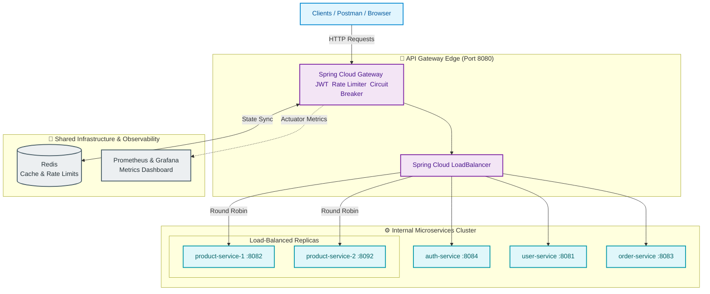

# Smart API Gateway

A standalone API Gateway built with **Spring Cloud Gateway**, demonstrating a
full production-style feature set, exercised against a small e-commerce
microservice suite (Auth, User, Product, Order).

```
✅ API Routing               ✅ Redis Rate Limiter (Token Bucket)
✅ Reverse Proxy             ✅ Round Robin Load Balancer
✅ Dynamic Route Config      ✅ Health Checks
✅ JWT Authentication        ✅ Response Cache + TTL
✅ Request Logging + IDs     ✅ Circuit Breaker
✅ Retry + Timeout Handling
✅ Metrics Dashboard (Prometheus + Grafana)
```

---

## High Level Architecture


---

## Project structure

```
smart-api-gateway/
├── docker-compose.yml                 one-command startup for all 9 containers
├── pom.xml                            parent aggregator (Java 21, shared dependency versions)
│
├── gateway-service/                    core project
│   ├── Dockerfile
│   └── src/main/java/com/sag/gateway/
│       ├── GatewayApplication.java
│       ├── config/                     JWT + security + Redis config/properties
│       ├── security/                   JWT VALIDATION only (never issues tokens)
│       ├── filter/                     correlation ID/logging + custom response cache filter
│       └── controller/                 dynamic route admin API + circuit-breaker fallbacks
│
├── demo-services/
│   ├── auth-service/    (port 8084)    the ONLY place JWTs are issued
│   ├── user-service/    (port 8081)
│   ├── product-service/ (port 8082)    run as 2 instances for load balancing
│   └── order-service/   (port 8083)    calls user/product-service directly
│
├── infra/
│   ├── prometheus/prometheus.yml       scrape config
│   └── grafana/                        auto-provisioned datasource + dashboard

```

---
## Prerequisites

| Tool | Required version | Notes |
|---|---|---|
| **Docker + Docker Compose** | Recent (Compose v2) | **This is now the primary, recommended way to run the project** - see below |
| **Java (JDK)** | **21** | Only needed if you want to run modules manually outside Docker |
| **Maven** | **3.9.x** | Only needed for manual mode - do **not** use 3.5.x (too old for Spring Boot 3.x plugin tooling) |

Given the number of moving parts now (Redis, 5 Spring Boot services, 2
product-service instances, Prometheus, Grafana), **Docker Compose is by
far the easiest way to run this** - one command starts and correctly wires
up all 9 containers. Manual/IDE mode is still fully documented further
down for anyone who wants to debug a specific module.

---

## Quick Start (Docker Compose - recommended)

```bash
# From the project root (where docker-compose.yml lives)
docker compose up --build -d
```

First run takes a few minutes (Maven builds each module inside its own
container). Subsequent runs are much faster thanks to Docker layer
caching.

**Check everything is healthy:**
```bash
docker compose ps
```
You should see 9 containers: `redis`, `auth-service`, `user-service`,
`product-service`, `product-service-2`, `order-service`,
`gateway-service`, `prometheus`, `grafana` - all `healthy` or `running`.

**To stop everything:**
```bash
docker compose down
```
One command, tears down all 9 containers and the network. Nothing else
to clean up (all databases are in-memory).

---

## Try it out - a full walkthrough, feature by feature

All requests below go through the gateway only (`http://localhost:8080`).

### 1. Register a user and log in (JWT Authentication)

A demo account already exists out of the box - `demo` / `Demo@1234` - so
you can skip straight to login if you want.

```bash
# Register (optional - a "demo" user already exists)
curl -X POST http://localhost:8080/api/auth/register \
  -H "Content-Type: application/json" \
  -d '{"username":"sneha","password":"Sneha@1234"}'

# Login - get a JWT
curl -X POST http://localhost:8080/api/auth/login \
  -H "Content-Type: application/json" \
  -d '{"username":"demo","password":"Demo@1234"}'
```

Response looks like:
```json
{
  "token": "eyJhbGciOiJIUzI1NiJ9...",
  "tokenType": "Bearer",
  "expiresInSeconds": 3600,
  "username": "demo"
}
```

Save that token - every other endpoint needs it.
```bash
export TOKEN="paste-your-token-here"
```

### 2. Confirm JWT validation is actually enforced

```bash
# No token -> 401
curl -i http://localhost:8080/api/products

# With token -> 200
curl -i http://localhost:8080/api/products -H "Authorization: Bearer $TOKEN"
```

### 3. Reverse Proxy / Routing

```bash
curl http://localhost:8080/api/users -H "Authorization: Bearer $TOKEN"
curl http://localhost:8080/api/products -H "Authorization: Bearer $TOKEN"
curl -X POST http://localhost:8080/api/orders -H "Authorization: Bearer $TOKEN" \
  -H "Content-Type: application/json" -d '{"userId":1,"productId":1,"quantity":2}'
```

### 4. Dynamic Route Configuration (no restart needed)

List every currently active route (loaded from YAML + anything added at runtime):
```bash
curl http://localhost:8080/admin/routes
```

Add a brand-new route on the fly - here's a trivial example that proxies
`/api/echo/**` to an external test endpoint:
```bash
curl -X POST http://localhost:8080/admin/routes \
  -H "Content-Type: application/json" \
  -d '{
        "id": "demo-dynamic-route",
        "uri": "http://httpbin.org",
        "predicates": [{"name": "Path", "args": {"pattern": "/api/echo/**"}}],
        "filters": [{"name": "StripPrefix", "args": {"parts": "2"}}]
      }'
```
Check it took effect immediately (no restart):
```bash
curl http://localhost:8080/actuator/gateway/routes
```
Remove it just as easily:
```bash
curl -X DELETE http://localhost:8080/admin/routes/demo-dynamic-route
```
> Note: if you add/update a route with the **same id** as one of the
> pre-loaded ones (e.g. `user-service-route`), both the YAML version and
> your new version will exist side by side - use a unique id for anything
> new, as in the example above.

### 5. Request Logging + Correlation ID

```bash
curl -i http://localhost:8080/api/products -H "Authorization: Bearer $TOKEN"
```
Look for the `X-Correlation-Id` response header - the same ID appears in
the gateway's logs (`docker compose logs gateway-service`) tying the
request and response log lines together. Send your own and it's honored
instead of a generated one:
```bash
curl -i http://localhost:8080/api/products \
  -H "Authorization: Bearer $TOKEN" \
  -H "X-Correlation-Id: my-custom-trace-id-123"
```

### 6. Redis Rate Limiter (Token Bucket)

The auth route is deliberately tight (5 requests/sec, burst 10) to
simulate brute-force protection. Hammer it and watch some requests get
`429 Too Many Requests`:
```bash
for i in $(seq 1 20); do
  curl -s -o /dev/null -w "%{http_code}\n" -X POST http://localhost:8080/api/auth/login \
    -H "Content-Type: application/json" -d '{"username":"demo","password":"wrong"}'
done
```

### 7. Round Robin Load Balancer + Health Checks

```bash
for i in $(seq 1 6); do
  curl -s -i http://localhost:8080/api/products \
    -H "Authorization: Bearer $TOKEN" | grep -i "X-Upstream-Instance\|X-Cache"
done
```
Watch `X-Upstream-Instance` alternate between the two product-service
containers (round robin) on cache MISSes. If you stop one instance
(`docker compose stop product-service-2`), the health-check-aware load
balancer detects it within ~10s and routes everything to the remaining
instance automatically - no errors, no restart needed.

### 8. Response Cache + TTL

```bash
# First call - MISS (hits the real service)
curl -i http://localhost:8080/api/products -H "Authorization: Bearer $TOKEN" | grep -i X-Cache

# Second call within 30s - HIT (served from Redis, no upstream call)
curl -i http://localhost:8080/api/products -H "Authorization: Bearer $TOKEN" | grep -i X-Cache

# Wait 30+ seconds, call again - MISS again (TTL expired)
```

### 9. Circuit Breaker + Retry + Timeout

Stop a downstream service and watch the gateway degrade gracefully
instead of hanging or erroring raw:
```bash
docker compose stop product-service product-service-2
curl -i http://localhost:8080/api/products -H "Authorization: Bearer $TOKEN"
# -> 503, clean JSON body from the gateway's own fallback controller,
#    not a connection-refused error or a long hang
docker compose start product-service product-service-2
```
The **Retry** filter (2 retries with backoff) fires first for transient
failures on GET requests; if the breaker has already tripped open after
repeated failures, requests go straight to the fallback for ~10 seconds
before it tries again (half-open state).

### 10. Metrics Dashboard

Open **http://localhost:3000** (Grafana - no login needed, anonymous
viewing is enabled; `admin`/`admin` if you want to edit). The "Smart API
Gateway" dashboard is pre-loaded with:
- Request rate by route
- Average response time by route
- Requests by outcome (success / client error / server error)
- Cache hit vs miss rate
- Circuit breaker state
- Gateway JVM heap usage

Raw Prometheus is also browsable directly at **http://localhost:9090**,
and the raw metrics feed the dashboard reads from is at
`http://localhost:8080/actuator/prometheus`.

> If a panel shows "No data", the underlying Micrometer metric name may
> have shifted slightly in a Spring Cloud Gateway/Resilience4j version
> newer than this project was built against - check the exact metric
> name at `/actuator/prometheus` and adjust the panel's query in Grafana
> (Dashboard settings → JSON Model, or edit the panel directly).

---

## Full endpoint reference

| Method | Path (via gateway) | Auth required? | Description |
|---|---|---|---|
| POST | `/api/auth/register` | No | Create a new user |
| POST | `/api/auth/login` | No | Get a JWT |
| GET/POST/PUT/DELETE | `/api/users/**` | Yes | User CRUD |
| GET/POST/PUT/DELETE | `/api/products/**` | Yes | Product CRUD (cached, load-balanced) |
| GET/POST | `/api/orders/**` | Yes | Place/list orders |
| GET | `/admin/routes` | No* | List all active routes |
| POST | `/admin/routes` | No* | Add/update a route (live, no restart) |
| DELETE | `/admin/routes/{id}` | No* | Remove a route (live, no restart) |
| GET | `/actuator/health` | No | Gateway health |
| GET | `/actuator/gateway/routes` | No | Raw routing table |
| GET | `/actuator/prometheus` | No | Raw metrics feed |

\* Left open for demo convenience - see "Security notes" below.

---

## Important Considerations

- The JWT secret is a literal string in two YAML files, kept identical on
  purpose so the demo works out of the box. In production this belongs in
  a shared secrets manager (Vault, AWS Secrets Manager, etc.), never in
  source control.
- `/admin/routes` and `/actuator/**` are intentionally left open (no JWT
  required) so they're easy to demo. In a real deployment, lock these down
  to admin-only credentials or a separate internal network.
- Passwords are hashed with BCrypt in auth-service - never stored or
  logged in plaintext.

---

## Manual / IDE mode (without Docker)

Possible, but you're taking on everything Docker Compose otherwise
handles for you: a local Redis instance, and (optionally) a second
product-service instance for the load-balancing demo.

### 1. Start Redis locally
```bash
docker run -d --name redis -p 6379:6379 redis:7-alpine
```
(Or install Redis natively - any Redis reachable at `localhost:6379` works.)

### 2. Build everything once
```bash
mvn clean install
```

### 3. Start each service in its own terminal, in this order
```bash
# Terminal 1
cd demo-services/auth-service && mvn spring-boot:run

# Terminal 2
cd demo-services/user-service && mvn spring-boot:run

# Terminal 3
cd demo-services/product-service && mvn spring-boot:run

# Terminal 4 (OPTIONAL - only if you want to see load balancing in action)
cd demo-services/product-service && SERVER_PORT=8092 mvn spring-boot:run

# Terminal 5
cd demo-services/order-service && mvn spring-boot:run

# Terminal 6
cd gateway-service && mvn spring-boot:run
```

If you skip Terminal 4, everything still works fine - the gateway's
health-check-aware load balancer detects the second instance is
unreachable and quietly routes everything to instance #1 only, no errors.

### To stop
`Ctrl + C` in each terminal (and `docker stop redis` if you started Redis
via Docker). Nothing else to clean up.

---

