# Smart API Gateway

A robust, enterprise-grade **API Gateway** built with **Spring Cloud Gateway** and **Java 21**, designed for high throughput, seamless microservice routing, centralized security, dynamic configuration, and full observability. Demonstrated against an e-commerce microservices cluster.

---

## Project Overview

**Smart API Gateway** serves as the single point of entry for client applications, abstracting backend microservices while managing cross-cutting concerns like dynamic routing, JWT validation, Redis-backed rate limiting, response caching, circuit breaking, round-robin load balancing, distributed tracing, and Prometheus/Grafana monitoring.

---

## High Level Architecture

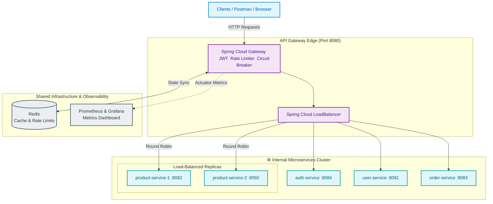
```mermaid
    graph TB
    %% Colors and Styles Configuration
        classDef client fill:#E1F5FE,stroke:#0288D1,stroke-width:2px,color:#01579B;
        classDef gateway fill:#F3E5F5,stroke:#7B1FA2,stroke-width:2px,color:#4A148C;
        classDef infra fill:#ECEFF1,stroke:#455A64,stroke-width:2px,color:#263238;
        classDef service fill:#E0F7FA,stroke:#0097A7,stroke-width:2px,color:#006064;
    
        Client[ Clients / Postman / Browser]:::client
    
    subgraph Gateway_Tier [" API Gateway Edge (Port 8080)"]
    GW[Spring Cloud Gateway <br> JWT  Rate Limiter  Circuit Breaker]:::gateway
    LB[Spring Cloud LoadBalancer]:::gateway
    end
    
    subgraph Infra_Tier [" Shared Infrastructure & Observability"]
    Redis[(Redis <br> Cache & Rate Limits)]:::infra
    Prometheus[Prometheus & Grafana <br> Metrics Dashboard]:::infra
    end
    
    subgraph Microservices_Tier ["⚙ Internal Microservices Cluster"]
    Auth[auth-service :8084]:::service
    User[user-service :8081]:::service
    Order[order-service :8083]:::service
    
    subgraph Product_Cluster ["Load-Balanced Replicas"]
    Prod1[product-service-1 :8082]:::service
    Prod2[product-service-2 :8092]:::service
    end
    end
    
    Client -->|HTTP Requests| GW
    GW <-->|State Sync| Redis
    GW -.->|Actuator Metrics| Prometheus
    GW --> LB
    
    LB --> Auth
    LB --> User
    LB --> Order
    LB -->|Round Robin| Prod1 & Prod2
```

---

## Project Structure

```
smart-api-gateway/
├── docker-compose.yml                 
├── pom.xml                           
│
├── gateway-service/                    core project
│   ├── Dockerfile
│   └── src/main/java/com/sag/gateway/
│       ├── GatewayApplication.java
│       ├── config/                     JWT + security + Redis config/properties
│       ├── security/                   JWT VALIDATION only
│       ├── filter/                     correlation ID/logging + custom response cache filter
│       └── controller/                 dynamic route admin API + circuit-breaker fallbacks
│
├── demo-services/
│   ├── auth-service/    (port 8084)    JWTs are issued
│   ├── user-service/    (port 8081)
│   ├── product-service/ (port 8082)    run as 2 instances for load balancing
│   └── order-service/   (port 8083)    calls user/product-service directly
│
├── infra/
│   ├── prometheus/prometheus.yml       scrape config
│   └── grafana/                        auto-provisioned datasource + dashboard
```

---

## Tech Stack

* **Language & Runtime:** Java 21
* **Framework:** Spring Boot 3.x, Spring Cloud Gateway (Reactive / WebFlux)
* **Security:** Spring Security, Reactive JWT (`jjwt`), BCrypt
* **Resilience & Fault Tolerance:** Resilience4j (Circuit Breaker, Retry, Rate Limiter)
* **Caching & Storage:** Redis, Spring Data Reactive Redis
* **Load Balancing:** Spring Cloud LoadBalancer
* **Observability & Monitoring:** Micrometer, Prometheus, Grafana
* **Containerization:** Docker, Docker Compose
* **Build System:** Apache Maven 3.9+

---

## Running the Project (Docker Compose)

### 1. Start All Services
```bash
# Clone the repository and navigate to root directory
git clone https://github.com/your-username/smart-api-gateway.git
cd smart-api-gateway

# Build and start all 9 containers in background mode
docker compose up --build -d
```

### 2. Verify Container Health
```bash
docker compose ps
```
*You should see 9 healthy containers: `gateway-service`, `auth-service`, `user-service`, `product-service`, `product-service-2`, `order-service`, `redis`, `prometheus`, and `grafana`.*

### 3. Tear Down / Stop
```bash
docker compose down
```

---

## Features & Results

Here is the complete walkthrough of all 12 core backend features implemented in the API Gateway with request payloads and visual verification.

---

### Feature 1: API Routing
* **Description:** Dynamically routes incoming HTTP requests to target downstream microservices based on URL path matching.
* **Example Request Payload / Command:**
```bash
curl -i http://localhost:8080/api/products   -H "Authorization: Bearer $TOKEN"
```
* **Result:**
  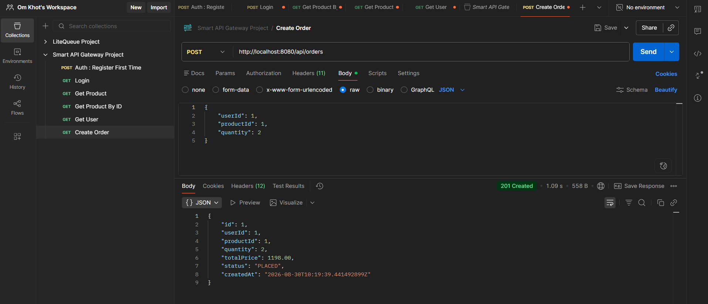

---

### Feature 2: Reverse Proxy
* **Description:** Acts as an edge gateway hiding backend microservice infrastructure and internal port topologies from public clients.
* **Example Request Payload / Command:**
```bash
curl -i http://localhost:8080/api/users   -H "Authorization: Bearer $TOKEN"
```
* **Result:**
  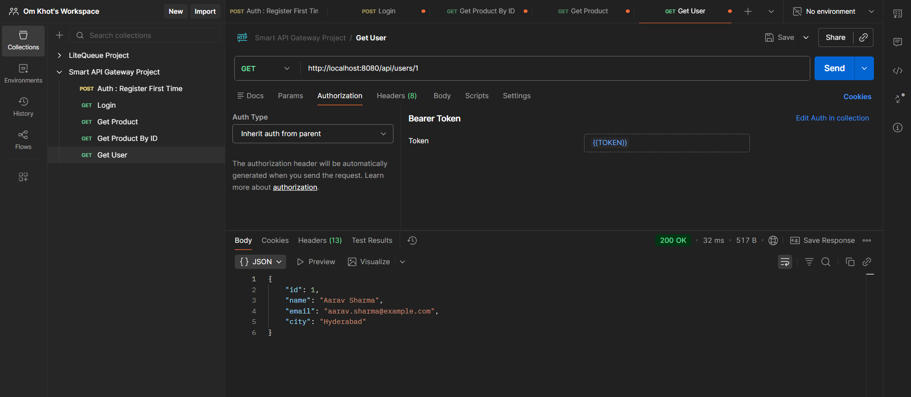

---

### Feature 3: Dynamic Route Configuration
* **Description:** Enables runtime creation, updating, and deletion of routes via Admin API endpoints without requiring service restarts.
* **Example Request Payload / Command:**
```bash
# Create route dynamically at runtime
curl -X POST http://localhost:8080/admin/routes   -H "Content-Type: application/json"   -d '{
        "id": "demo-dynamic-route",
        "uri": "http://httpbin.org",
        "predicates": [{"name": "Path", "args": {"pattern": "/api/echo/**"}}],
        "filters": [{"name": "StripPrefix", "args": {"parts": "2"}}]
      }'

# Query active routes
curl http://localhost:8080/admin/routes
```
* **Result:**
  
  

---

### Feature 4: JWT Authentication & Authorization
* **Description:** Performs reactive token validation at the gateway level to reject unauthorized requests before reaching internal microservices.
* **Example Request Payload / Command:**
```bash
# First-time User Registration
curl -X POST http://localhost:8080/api/auth/register   -H "Content-Type: application/json"   -d '{"username":"varad","password":"varad@1234"}'

# User Login to receive JWT
curl -X POST http://localhost:8080/api/auth/login   -H "Content-Type: application/json"   -d '{"username":"demo","password":"Demo@1234"}'
```
* **Result:**
  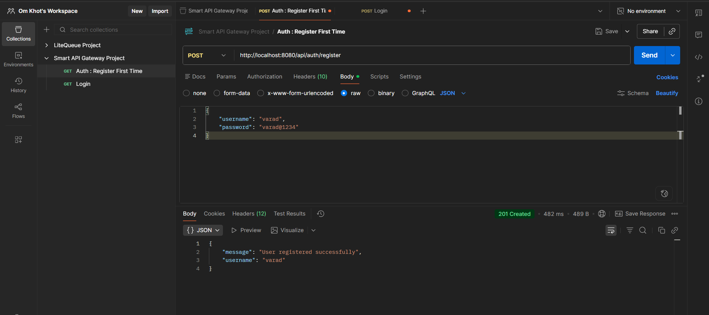
  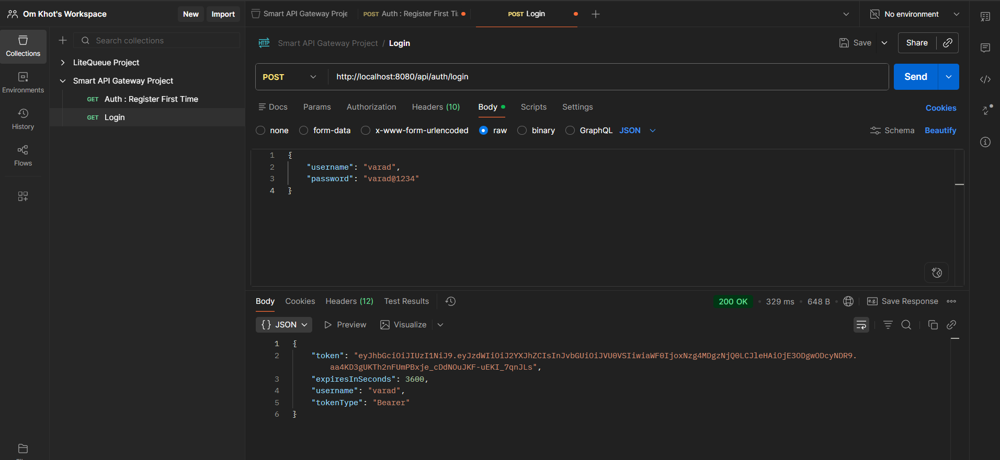
* If the request to any microservice done without sending the token then it will show unauthorized error.
* This helps to segregate the logic of authentication for every service at single place
  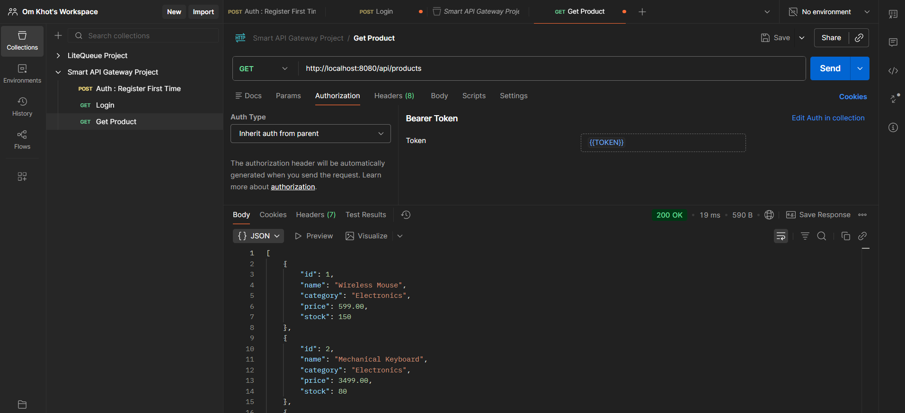
  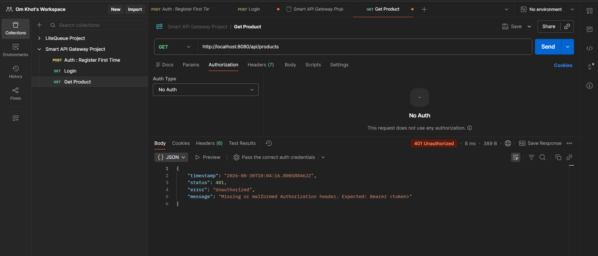

---

### Feature 5: Request Logging + Correlation ID
* **Description:** Generates or passes through unique `X-Correlation-Id` headers to ensure unified distributed logging across microservices.
* **Example Request Payload / Command:**
```bash
curl -i http://localhost:8080/api/products   -H "Authorization: Bearer $TOKEN"   -H "X-Correlation-Id: trace-id-custom-99182"
```
* **Result:**
  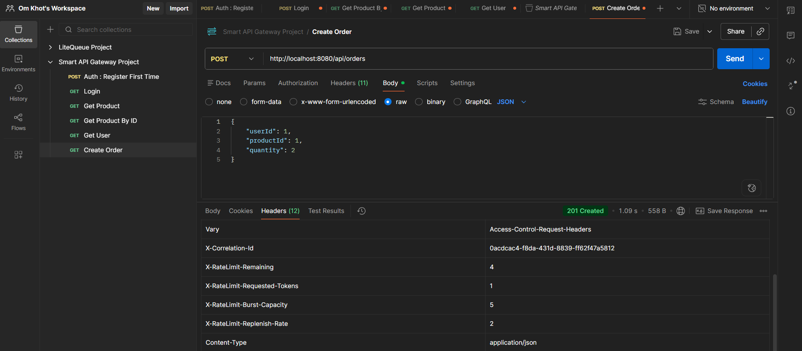

---

### Feature 6: Retry + Timeout Handling
* **Description:** Automatically retries transient GET request failures with exponential backoff while enforcing strict gateway gateway-to-backend timeouts.
* **Example Request Payload / Command:**
```bash
# Triggered automatically when upstream services experience transient network blips
curl -i http://localhost:8080/api/products   -H "Authorization: Bearer $TOKEN"
```
* **Result:**
  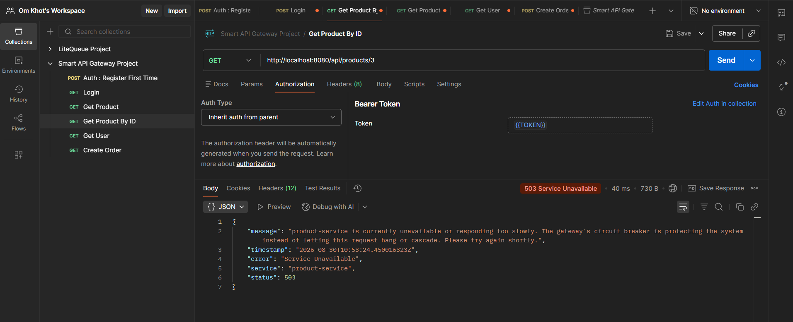

---

### Feature 7: Response Cache + TTL
* **Description:** Caches downstream GET responses inside Redis with custom TTL policies to reduce database queries and improve latency.
* **Example Request Payload / Command:**
```bash
# Initial request -> Cache MISS
curl -i http://localhost:8080/api/products -H "Authorization: Bearer $TOKEN"

# Subsequent request within 30s -> Cache HIT
curl -i http://localhost:8080/api/products -H "Authorization: Bearer $TOKEN"
```
* **Result:**
  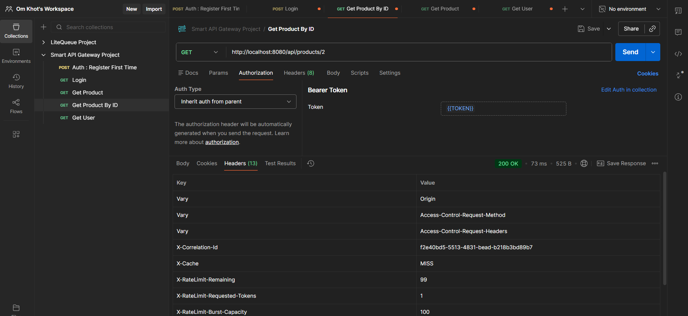
  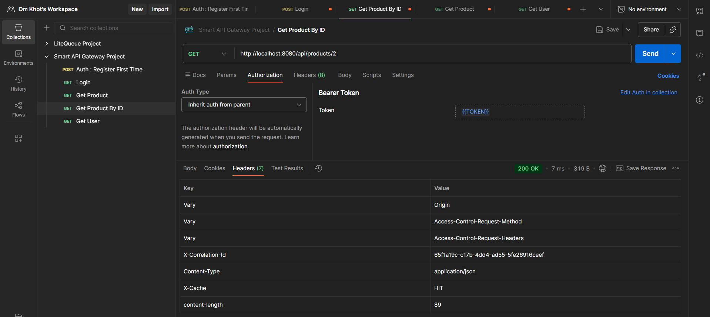
  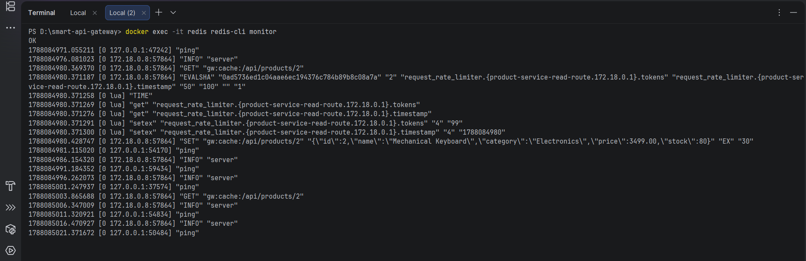

---

### Feature 8: Redis Rate Limiter (Token Bucket Algorithm)
* **Description:** Controls request throughput per client IP/Route using Redis-backed Token Bucket algorithm, returning `429 Too Many Requests` on breach.
* **Example Request Payload / Command:**
```bash
# Exceed rate limit thresholds (e.g., > 5 req/sec on login)
for i in $(seq 1 20); do
  curl -s -o /dev/null -w "%{http_code}
" -X POST http://localhost:8080/api/auth/login     -H "Content-Type: application/json" -d '{"username":"demo","password":"wrong"}'
done
```
* **Result:**
  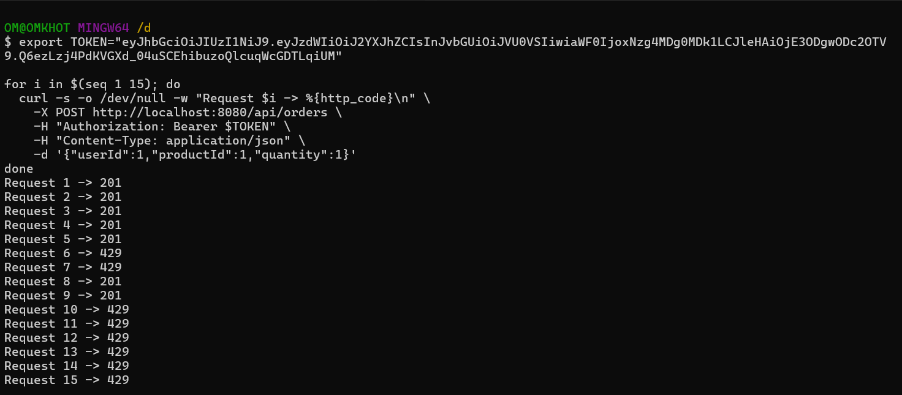
  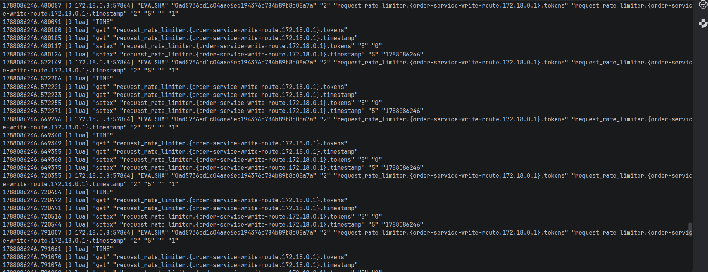

---

### Feature 9: Circuit Breaker & Fallback
* **Description:** Utilizes Resilience4j to prevent cascading system failure by opening circuit on downstream outage and executing clean fallback responses.
* **Example Request Payload / Command:**
```bash
# Stop backend instances
docker compose stop product-service product-service-2

# Execute request -> Returns 503 Gateway Fallback JSON response
curl -i http://localhost:8080/api/products -H "Authorization: Bearer $TOKEN"
```
* **Result:**
  
* This helps the other depended microservice to give proper error without halting for long time
  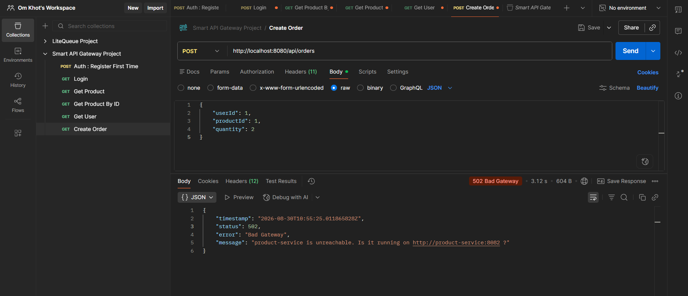

---

### Feature 10: Round Robin Load Balancer
* **Description:** Evenly distributes incoming traffic across healthy replica instances (`product-service` & `product-service-2`) via Spring Cloud LoadBalancer.
* **Example Request Payload / Command:**
```bash
for i in $(seq 1 6); do
  curl -s -i http://localhost:8080/api/products     -H "Authorization: Bearer $TOKEN" | grep -i "X-Upstream-Instance"
done
```
* **Evidence / Result:**
  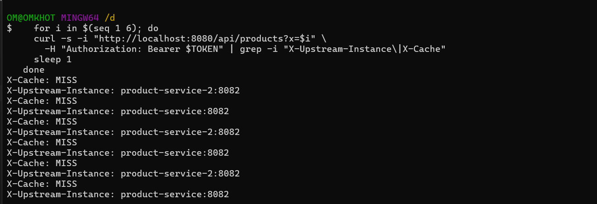
* If only one instance is up then traffic will go to the only one up instance
  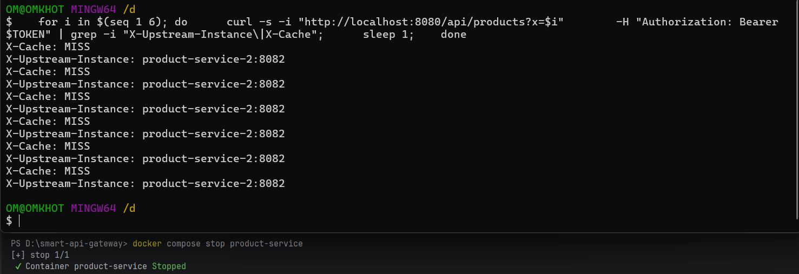

* K6 Load testing and analysis of different latencies
  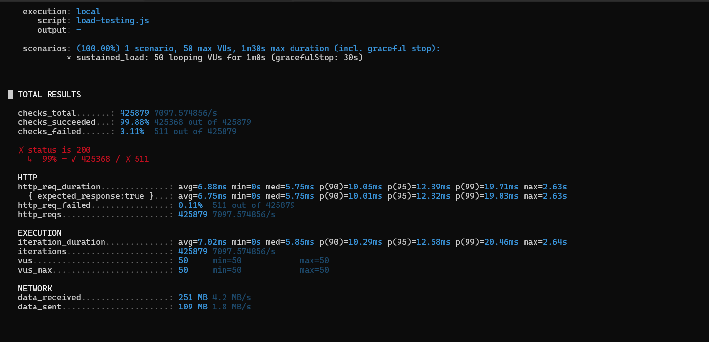

---

### Feature 11: Health Checks
* **Description:** Actively monitors container health metrics and automatically routes traffic away from unhealthy or unreachable microservices.
* **Example Request Payload / Command:**
```bash
curl -i http://localhost:8080/actuator/health
```
* **Result:**
* Shows that when one of the server is down then traffic is routed to rest one 
  

---

### Feature 12: Metrics Dashboard (Prometheus + Grafana)
* **Description:** Exports gateway operational metrics via Spring Actuator & Prometheus, presenting live request rates, latencies, and circuit breaker status in Grafana.
* **Example Request Payload / Command:**
```bash
# Prometheus endpoint
curl http://localhost:8080/actuator/prometheus

# Grafana Dashboard UI
http://localhost:3000
```
* **Result:**
  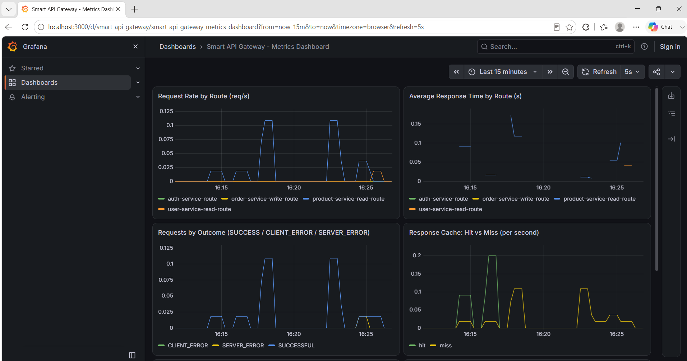
  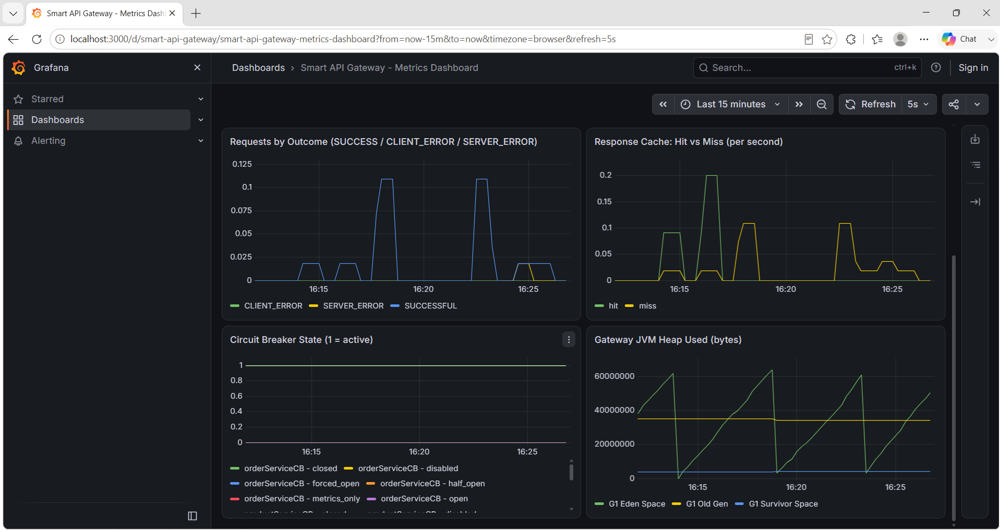

---

## Full endpoint reference

| Method | Path (via gateway) | Auth required? | Description |
|---|---|---|---|
| POST | `/api/auth/register` | No | Create a new user |
| POST | `/api/auth/login` | No | Get a JWT |
| GET/POST/PUT/DELETE | `/api/users/**` | Yes | User CRUD |
| GET/POST/PUT/DELETE | `/api/products/**` | Yes | Product CRUD (cached, load-balanced) |
| GET/POST | `/api/orders/**` | Yes | Place/list orders |
| GET | `/admin/routes` | No* | List all active routes |
| POST | `/admin/routes` | No* | Add/update a route (live, no restart) |
| DELETE | `/admin/routes/{id}` | No* | Remove a route (live, no restart) |
| GET | `/actuator/health` | No | Gateway health |
| GET | `/actuator/gateway/routes` | No | Raw routing table |
| GET | `/actuator/prometheus` | No | Raw metrics feed |

\* Left open for demo convenience

---

## Important Considerations

- The JWT secret is a literal string in two YAML files, kept identical on
  purpose so the demo works out of the box. In production this belongs in
  a shared secrets manager (Vault, AWS Secrets Manager, etc.), never in
  source control.
- `/admin/routes` and `/actuator/**` are intentionally left open (no JWT
  required) so they're easy to demo. In a real deployment, lock these down
  to admin-only credentials or a separate internal network.
- Passwords are hashed with BCrypt in auth-service - never stored or
  logged in plaintext.

---

## Manual / IDE mode (without Docker)

Possible, but you're taking on everything Docker Compose otherwise
handles for you: a local Redis instance, and (optionally) a second
product-service instance for the load-balancing demo.

### 1. Start Redis locally
```bash
docker run -d --name redis -p 6379:6379 redis:7-alpine
```
(Or install Redis natively - any Redis reachable at `localhost:6379` works.)

### 2. Build everything once
```bash
mvn clean install
```

### 3. Start each service in its own terminal, in this order
```bash
# Terminal 1
cd demo-services/auth-service && mvn spring-boot:run

# Terminal 2
cd demo-services/user-service && mvn spring-boot:run

# Terminal 3
cd demo-services/product-service && mvn spring-boot:run

# Terminal 4 (OPTIONAL - only if you want to see load balancing in action)
cd demo-services/product-service && SERVER_PORT=8092 mvn spring-boot:run

# Terminal 5
cd demo-services/order-service && mvn spring-boot:run

# Terminal 6
cd gateway-service && mvn spring-boot:run
```
---